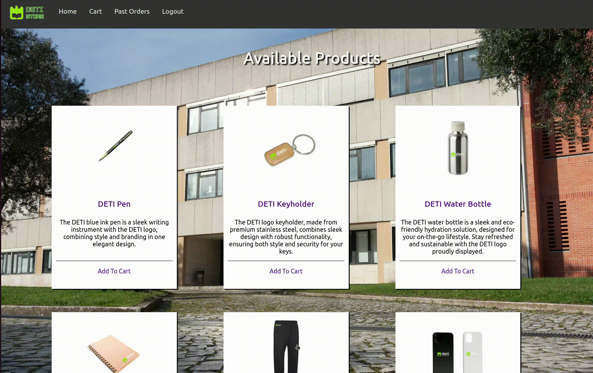

# First SIO Project: DETI Store

## Index

1. [Introduction](#1-introduction)
2. [Overview](#2-overview)
3. [CWE Overview](#3-cwe-overview-table)
4. [Vulnerabilities](#4-vulnerabilities)
    1. [CWE-79: Improper Neutralization of Input During Web Page Generation ('Cross-site Scripting')](#41-cwe-79-improper-neutralization-of-input-during-web-page-generation-cross-site-scripting)
    2. [CWE 89: Improper Neutralization of Special Elements used in an SQL Command ('SQL Injection')](#42-cwe-89-improper-neutralization-of-special-elements-used-in-an-sql-command-sql-injection)
    3. [CWE-20: Improper Input Validation](#43-cwe-20-improper-input-validation)
    4. [CWE-256: Plaintex Storage of a Password](#44-cwe-256-plaintex-storage-of-a-password)
    5. [CWE-521: Weak Password Requirements](#45-cwe-521-weak-password-requirements)
    6. [CWE-434: Unrestricted Upload of File with Dangerous Type](#46-cwe-434-unrestricted-upload-of-file-with-dangerous-type)
5. [Final considerations](#5-final-considerations)
6. [References](#6-references)


## 1. Introduction 
This report works as documention for the first SIO assignment, where it was requested that we develop an insecure application of an e-commerce store and through the inspection of its vulnerabilities, we should create a secure version of the same application.
#
## 2. Overview
In this assignment we decided to work with Flask, using a SQLAlchemy database for persistence of the data and Jinja2 for rendering data in the templates. For the fronted we utilized pure HTML and CSS.
#
## 3. CWE Overview (Table)
| CWE    | Description | CVSS | String Vector | Fix |
| -------- | ------- | ------- | -------- | ------- |
| CWE-79: Improper Neutralization of Input During Web Page Generation ('Cross-site Scripting') | The product does not neutralize or incorrectly neutralizes user-controllable input before it is placed in output that is used as a web page that is served to other users.   | 7.1 (High) | CVSS:3.0/AV:N/AC:L/PR:N/UI:R/S:C/C:L/I:L/A:L     | Retrieve user input using methods provided by the request object, followed by thorough data validation and analysis. Ensure proper user input sanitization and escaping.
| CWE 89: Improper Neutralization of Special Elements used in an SQL Command ('SQL Injection') | Without sufficient removal or quoting of SQL syntax in user-controllable inputs, the generated SQL query can cause those inputs to be interpreted as SQL instead of ordinary user data. | 9.8 (Critical) | CVSS:3.0/AV:N/AC:L/PR:N/UI:N/S:U/C:H/I:H/A:H     | Use an ORM Object-Relational Mapping (like SQLAlchemy)
| CWE-20: Improper Input Validation    | The product receives input or data, but it does not validate or incorrectly validates that the input has the properties that are required to process the data safely and correctly. | 5.5 (Medium) |CVSS:3.0/AV:L/AC:L/PR:L/UI:N/S:U/C:N/I:N/A:H| Validate every input, as in making sure that every parameter follows the expected pattern and doesn't contain malicious sequences of characters. 
| CWE-256: Plaintex Storage of a Password   | Storing a plaintext password in a configuration file allows anyone who can read the file access to the password-protected resource.    | 9.6 (Critical)  |CVSS:3.0/AV:N/AC:L/PR:N/UI:R/S:C/C:H/I:H/A:H  | Encode the passwords (for example, using an hash function) before storing them in the database.
| CWE-521: Weak Password Requirements   | The product does not require that users should have strong passwords, which makes it easier for attackers to compromise user accounts. | 7.5 (High) | CVSS:3.0/AV:N/AC:L/PR:N/UI:N/S:U/C:H/I:N/A:N | Alert the user about how strong their password is when creating an account and force them to follow a set of rules (for example, a password should at least be 8 characters long).
| CWE-434: Unrestricted Upload of File with Dangerous Type | The product allows the attacker to upload or transfer files of dangerous types that can be automatically processed within the product's environment. | 7.5 (High) |CVSS:3.0/AV:N/AC:L/PR:N/UI:N/S:U/C:H/I:H/A:N | Use an "accept" atribute in the input type="file" element that only allows users to upload files of a certain type.
#

### How did we calculate CVSS and the String Vector?


The Common Vulnerability Scoring System (CVSS) provides a way to capture the principal characteristics of a vulnerability and produce a numerical score reflecting its severity. The numerical score can then be translated into a textual representation, which is known as the Vector String. This Vector String reflects the values for each metric represented in the CVSS score.

To calculate the CVSS Vector String, we assess and score the following metrics that describe the characteristics of the vulnerability:

`Attack Vector (AV)` : This metric reflects how the vulnerability is exploited. E.g., local access (L), adjacent network (A), network (N).

`Attack Complexity (AC)`: This represents the complexity of the attack required to exploit the vulnerability. It can be low (L) or high (H).

`Privileges Required (PR)`: This indicates the level of privileges an attacker must possess for successful exploitation. It can be none (N), low (L), or high (H).

`User Interaction (UI)`: This metric determines if the vulnerability requires user participation to be exploited. It can be none (N) or required (R).

`Scope (S)`: This represents whether a vulnerability can affect resources beyond its security scope. It can be unchanged (U) or changed (C).

`Confidentiality (C), Integrity (I), and Availability (A)`: These metrics measure the impact on confidentiality, integrity, and availability of a system, respectively. They can be none (N), low (L), or high (H).


We used the [CVSS Calculator](https://www.first.org/cvss/calculator/3.0) to calculate the CVSS and the String Vector.

#

## 4. Vulnerabilities
## 4.1. CWE-79: Improper Neutralization of Input During Web Page Generation ('Cross-site Scripting')
* CVSS: 7.1 (High)	
* String Vector: 3.0/AV:N/AC:L/PR:N/UI:R/S:C/C:L/I:L/A:L

Cross-site scripting (XSS) is a type of security breach where an attacker introduces harmful scripts into the code of a reliable application or site. This is often done through a deceptive link that the attacker persuades a user to click on. Without proper cleaning of input data, this dubious link can run the attacker's code on the victim's device, potentially leading to the theft of session cookies.

XSS attacks fall into two categories:

1. Stored XSS: This occurs when a harmful script is saved on a server's database. It is then delivered to other users when they retrieve data, provided there is no adequate sanitization or encoding of the output.

2. Reflected XSS: This happens when a user's browser is tricked into running a script provided by an attacker because the web application reflects attacker-specified strings back to the browser as part of its response. This happens due to a lack of server-side validation.


### Here is an example of the vulnerability:

To test this vulnerability we commented the following code in the reviews of a product: 
``` html
<script>alert("You have been hacked!");</script> 
```

When we open the product page, the alert will pop up, which means that the application is vulnerable to XSS.


Now everytime any user opens the product page, the malicious script will run.




### Here is an example of the fix:

The Jinja2 Library is a templating language for Flask, it has built-in support to do automatic escaping of special characters in the template's variables, which means by using the correct syntax to show a variable in a template all characters that may be considered malicious code will be automatically converted into HTML entities, making it harmless.

To avoid XSS, it's important to make sure all inputs by the user are escaped correctly before they're shown in the web page. This includes data sent through forms, query strings or HTML header.

In Flask, it's possible to use the request object to get information on the user's solicitation. To avoid XSS the methods given by the request object are used to access the solicitation data and make sure they are escaped before utilized.

Besides this, it's crucial to use an input validation library, in this case we used WTForms, to sanitize inputs and avoid the injection of malicious code.

In the product.html in order to add a review we used the following code:

``` python

<form method="POST" action="/add_review" >
    <input type="hidden" name="product_id" value="{{ product.id }}">
    <label for="rating" style="font-size: 20px;">Rating (1-5):</label>
    <input type="number" name="rating" min="1" max="5" required style="width: 38px; height:20px; font-size: 18px;">
    <br>
    <br>
    <label for="comment" style="font-size: 20px;">Comment:</label>
    <br>
    <textarea name="comment" rows="4" cols="50"></textarea>
    <br>
    <button type="submit" style="margin-top:12px;width:150px; height: 40px; font-size:18px;">Submit Review</button>
    <input type="file" name="file" id="file" accept=".jpg, .png, .gif">
</form>

```
Now when the attacker tries to inject a malicious script, the application will escape it, and the code will not be executed.


#
## 4.2. CWE 89: Improper Neutralization of Special Elements used in an SQL Command ('SQL Injection')
* CVSS: 9.8 (Critical)
* String Vector: CVSS:3.0/AV:N/AC:L/PR:N/UI:N/S:U/C:H/I:H/A:H

The product constructs all or part of an SQL command using externally-influenced input from an upstream component, but it does not neutralize or incorrectly neutralizes special elements that could modify the intended SQL command when it is sent to a downstream component.

This can be used to alter query logic to bypass security checks, or to insert additional statements that modify the back-end database, possibly including execution of system commands. 

SQL Injection: Where attackers provide malicious inputs that are used to build SQL commands, allowing them access or modify data.

Script Injection: Where attackers provide malicious inputs that are executed as code on the client side, allowing them to access confidential information or take dangerous actions on the client's web browser

Command Injection: Where attackers provide malicious inputs that are executed as commands in the OS, allowing them to have admin permissions or change critical configurations.

### Here is an example of the vulnerability:

This is the code that is used to login the user:

```python
# import stuff to use the forms
from flask_wtf import FlaskForm
from wtforms import StringField, PasswordField, SubmitField, BooleanField

class LoginForm(FlaskForm):
    username = StringField('username', render_kw={"placeholder": "Username"})
    password = PasswordField('password', render_kw={"placeholder": "Password"})
    remember = BooleanField('remember me')
    submit = SubmitField('Login')

@app.route('/login', methods=['GET', 'POST'])
def login():
    form = LoginForm()
    if form.validate_on_submit():
        # CWE-89: Improper Neutralization of Special Elements used in an SQL Command ('SQL Injection')
        sql = text(f"SELECT * FROM user WHERE username = '{form.username.data}' AND password = '{form.password.data}'")
        result = db.session.execute(sql).fetchone()
        if result:
            user = User(result)
            login_user(user, remember=form.remember.data)
            return redirect(url_for('catalog'))
        else:
            session.pop('_flashes', None)
            flash('Invalid username or password')
    return render_template('login.html', form=form)
```

This code is easily exploitable, as the attacker can inject SQL commands in the username and password fields, and the application will execute them.

For example, if the attacker inputs these fields in the login page:
```
Username: ' OR '1'='1
Password: ' OR '1'='1
```
The application will execute the following SQL command:
```sql
SELECT * FROM user WHERE username = '' OR '1'='1' AND password = '' OR '1'='1'
```
This will always return the first user in the database, which means that the attacker will be able to login as said user (which may be the admin).


### Here is an example of the fix:

```python
@app.route('/login', methods=['GET', 'POST'])
def login():
    form = LoginForm()
    if form.validate_on_submit():
       user = User.query.filter_by(username = form.username.data).first()
    # ...
```

To fix this vulnerability, we used Object-Relational Mapping (SQLAlchemy), which allows us to use the *filter_by* method that will escape the SQL commands, and therefore, the attacker will not be able to inject SQL commands in the username and password fields.


#
## 4.3. CWE-20: Improper Input Validation
* CVSS: 5.5 (Medium)
* String Vector: CVSS:3.0/AV:L/AC:L/PR:L/UI:N/S:U/C:N/I:N/A:H

The product receives input or data, but it does not validate or incorrectly validates that the input has the properties that are required to process the data safely and correctly. 

When software does not validate input properly, an attacker is able to craft the input in a form that is not expected by the rest of the application. This will lead to parts of the system receiving unintended input, which may result in altered control flow, arbitrary control of a resource, or arbitrary code execution.

### Here is an example of the vulnerability:

This is the form that gathers the user's input to create an account:

```python
from flask_wtf import FlaskForm
from wtforms import StringField, PasswordField, SubmitField, SelectField

class RegisterForm(FlaskForm):
    username = StringField('username', render_kw={"placeholder": "Username"})
    password = PasswordField('password', render_kw={"placeholder": "Password"})
```

The user can input any character in the username and password fields, and the application will accept it, which may lead to future problems. For example, if the user inputs a special character like " ' ", the application will be vulnerable to attacks like SQL Injection.


### Here is an example of the fix:

To fix this vulnerability, we added the following code to the RegisterForm class:

```python
from flask_wtf import FlaskForm
from wtforms import StringField, PasswordField, SubmitField, SelectField
from wtforms.validators import InputRequired, Length, Email, ValidationError

def validate_date_format(form, field):
    if not re.match(r'\d{2}/\d{2}', field.data):
        raise ValidationError('Card Expiration must be in the format MM/YY.')

def required_if_credit_card(form, field):
    if form.payment_method.data == 'Credit Card' and not field.data:
        raise ValidationError('This field is required.')

def required_if_paypal(form, field):
    if form.payment_method.data == 'Paypal' and not field.data:
        raise ValidationError('This field is required.')

def required_if_mbway(form, field):
    if form.payment_method.data == 'MBWay' and not field.data:
        raise ValidationError('This field is required.')

class CheckoutForm(FlaskForm):
    first_name = StringField('First Name', validators=[InputRequired(), Length(min=2, max=20)], render_kw={"placeholder": "e.g. Jhon"})
    last_name = StringField('Last Name', validators=[InputRequired(), Length(min=2, max=20)], render_kw={"placeholder": "e.g. Doe"})
    phone_number = StringField('Phone Number', validators=[InputRequired(), Length(min=9, max=9)], render_kw={"placeholder": "e.g. 912345678"})
    email = StringField('Email', validators=[InputRequired(), Email()], render_kw={"placeholder": "e.g. email@ua.pt"})
    address = StringField('Address', validators=[InputRequired(), Length(min=2, max=100)], render_kw={"placeholder": "e.g. Cristiano Ronaldo Street 7"})
    city = StringField('City', validators=[InputRequired(), Length(min=2, max=100)])
    country = StringField('Country', validators=[InputRequired(), Length(min=2, max=20)])
    payment_method = SelectField('Payment Method', validators=[InputRequired()], choices=[('Credit Card', 'Credit Card'), ('Multibanco', 'Multibanco'), ('Paypal', 'Paypal'), ('MBWay', 'MBWay')])
    card_number = StringField('Card Number', validators=[Optional(), Length(min=16, max=16), required_if_credit_card], render_kw={"placeholder": "XXXX XXXX XXXX XXXX"})
    expiration_date = StringField('Card Expiration', validators=[Optional(), validate_date_format, required_if_credit_card], render_kw={"placeholder": "MM/YY"})
    cvv = StringField('Card CVV', validators=[Optional(), Length(min=3, max=3), required_if_credit_card], render_kw={"placeholder": "XXX"})
    paypal_email = StringField('PayPal Email', validators=[Optional(), Email(), required_if_paypal], render_kw={"placeholder": "paypal@email.com"})
    mbway_phone_number = StringField('Phone Number', validators=[Optional(), Length(min=9, max=9), required_if_mbway], render_kw={"placeholder": "e.g. 912345678"})
    
    submit = SubmitField('Checkout')

@app.route('/checkout', methods=['GET', 'POST'])
@login_required
def checkout():
    form = CheckoutForm()
    if form.validate_on_submit():
        # ... 
```

By adding the validators to the fields, we are able to validate the user's input, and if it doesn't follow the expected pattern, the application will not accept it.


#
## 4.4. CWE-256: Plaintex Storage of a Password
* CVSS: 9.6 (Critical)
* String Vector: CVSS:3.0/AV:N/AC:L/PR:N/UI:R/S:C/C:H/I:H/A:H

When the password is stored in plain text in the database, which means that if an attacker gains access to the database, they will be able to see the password in plain text. 

This is a critical vulnerability, as it allows the attacker to gain access to the user's account, and potentially to other accounts if the user uses the same password in multiple websites.


### Here is an example of the vulnerability:


This table shows how the User informations are being saved:

| ID | Username    | Password Hash   | Gender | Name           | Email                  | Status |
|----|-------------|-----------------|--------|----------------|------------------------|--------|
| 1  | joaozinho   | `Joaozinho%123` | Male   | joao           | joaozinho@gmail.com    | 0      |
| 2  | test        | `&Testes123`    | Male   | Test           | test@ua.pt             | 0      |


The attacker in the login page uses the improper input validation vulnerability to inject a SQL command (SELECT username, password FROM User) that will always return all the users and their passwords.

### Here is an example of the fix:
```python
from flask_bcrypt import Bcrypt
bcrypt = Bcrypt(app)


@app.route('/register', methods=['GET', 'POST'])
def register():
    form = RegisterForm()

    if  form.validate_on_submit():
        hashed_password = bcrypt.generate_password_hash(form.password.data)
        new_user = User(username=form.username.data, password=hashed_password, gender=form.gender.data, full_name=form.full_name.data, email=form.email.data)
        db.session.add(new_user)
        db.session.commit()
        return redirect(url_for('login'))
    
    return render_template('register.html', form=form)

@app.route('/login', methods=['GET', 'POST'])
def login():
    form = LoginForm()
    if form.validate_on_submit():
       user = User.query.filter_by(username = form.username.data).first()
       if user and bcrypt.check_password_hash(user.password, form.password.data):
           login_user(user, remember = form.remember.data)
           return redirect(url_for('catalog'))
       else:
           session.pop('_flashes', None)
           flash('Invalid username or password')
           
    return render_template('login.html', form = form)
```
We added the following line to the regiter function:
```
hashed_password = bcrypt.generate_password_hash(form.password.data)
```
And the following condition to the login function:
```
if bcrypt.check_password_hash(user.password, form.password.data):
```


For fixing this vulnerability, we used the library flask_bcrypt, which allows us to hash the password before storing it in the database. 

This way, even if the attacker gains access to the database (using the same command as above), they will not be able to see the password in plain text, as it will be in a not-human readable format.

The attacker still has access to the hashed password, but it will be much more difficult to crack it.

Now the table of how the User informations are being saved, is this:

| ID | Username    | Password Hash                                                      | Gender | Name           | Email                  | Status |
|----|-------------|--------------------------------------------------------------------|--------|----------------|------------------------|--------|
| 1  | joaozinho   | `$2b$12$8gqYrNip2TMhS/yFRzLHduIe6Jae.Q/owMKh8LgkqQMDrgPJXSvza`     | Male   | joao           | joaozinho@gmail.com    | 0      |
| 2  | test        | `$2b$12$nhQeraU.q/aNafddjn.09Obm9pp8Q1CcG2yg1D15jX4HMzfg5.WZS`     | Male   | Test           | test@ua.pt             | 0      |

#
## 4.5. CWE-521: Weak Password Requirements
* CVSS: 7.5 (High)
* String Vector: CVSS:3.0/AV:N/AC:L/PR:N/UI:N/S:U/C:H/I:N/A:N

When the password requirements are weak, it makes it easier for the attacker to guess the password, which can lead to the attacker gaining access to the user's account.

A weak password is short, common, a system default, or something that could be rapidly guessed by executing a brute force attack using a subset of all possible passwords, such as words in the dictionary, proper names, words based on the user name or common variations on these themes.

The attacker can easily steal user password using generic attack techniques (e.g. brute force attacks, authentication challenge theft, etc.)

### Here is an example of the vulnerability:


The user is creating an account, and the password requirements are weak, which means that the user can use a weak, common password, like "12345678".


### Here is an example of the fix:


On the register form, we added the following code to verify if the password is strong enough:

```python
    def validate_password(self, password):
        passw = password.data
        special_chars = "~!@#$%^&*()_+{}:;[]"
            
        if len(passw) < 8:
            raise ValidationError('Password must be at least 8 characters long.')
            
        if not any(char.isdigit() for char in passw):
            raise ValidationError('Password must contain at least one digit.')
            
        if not any(char.isupper() for char in passw):
            raise ValidationError('Password must contain at least one uppercase letter.')
            
        if not any(char.islower() for char in passw):
            raise ValidationError('Password must contain at least one lowercase letter.')
            
        if not re.search(r"[~\!@#\$%\^&\*\(\)_\+{}:;'\[\]]", passw):
            raise ValidationError(f'Password must contain at least one special character. {special_chars}')
            
        if re.search(r"[^a-zA-Z0-9~\!@#\$%\^&\*\(\)_\+{}\":;'\[\]]", passw):
            raise ValidationError(f'Password contains invalid character.\nOnly alphanumeric characters and these special characters are allowed: {special_chars}')
            
        return True
```

Now the user will be notify if the password is not strong enough, and will be forced to create a stronger password.


#
## 4.6. CWE-434: Unrestricted Upload of File with Dangerous Type

* CVSS: 7.5 (Hgh)
* String Vector: CVSS:3.0/AV:N/AC:L/PR:N/UI:N/S:U/C:H/I:H/A:N

If an application allows its users to upload files of unrestricted types, an attacker might use this lack of security to upload a risky type of file, and execute arbitrary HTML or script code, therefore, putting its users in danger.

### Here is an example of the vulnerability:

An attacker uploads a file in the products' review section. It was supposed to be for users to upload pictures of the product they order alongside their review in this field, however the bad actor sends a dangerous file (e.g. .exe, .py, .sh, etc).
In the insecure website this happens since the line where the upload is made hasn't got any analysis/validation about the file that is being posted, as you can observe next:

```html
<input type="file" name="file" id="file">
```


### Here is an example of the fix:

To quickly fix this vulnerability, we implemented an "accept" atributte containing only image types in the same line of html code.

```html
<input type="file" name="file" id="file" accept=".jpg, .png, .gif">
```

Now, when a user tries to choose a file from their desktop environment, they will only be able to search for .jpg, .png and .gif types. Other types of files don't even show up in the search window.


#
## 5. Final considerations
In this report we performed a thorough analysis of the CWEs (Common Weakness Enumeration) that we could find in our website.

We have looked into each of the six discovered vulnerabilities, examining the issues that could arise due their existence and detailing ways to resolve them.

This project provided us with a great understanding of the necessity of creating secure websites as not to suffer attacks which may have catastrophic consequences.

#
## 6. References
1. [Documentation provided in the curricular page](https://sweet.ua.pt/andre.zuquete/Aulas/SIO/23-24/index-docs.html)

2. [CWE Mitre](https://cwe.mitre.org/)

3. [Flask Documentation](https://flask.palletsprojects.com/en/3.0.x/)

4. [Jinja Documentation](https://jinja.palletsprojects.com/en/3.1.x/)

5. [WTForms Documentation](https://wtforms.readthedocs.io/en/3.1.x/)

6. [SQLAlchemy Documentation](https://docs.sqlalchemy.org/en/14/)

7. [Flask-Bcrypt Documentation](https://flask-bcrypt.readthedocs.io/en/latest/)

8. [CVSS Calculator](https://www.first.org/cvss/calculator/3.0)
